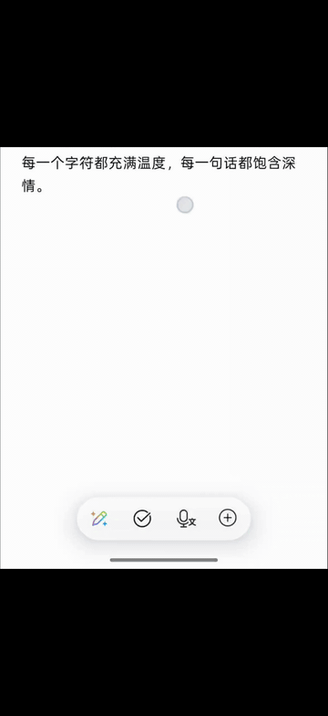

# 豆包字母键长按语音 / Doubao Letter Long-Press Voice

[](https://github.com/gehbfarr5/doubao-letter-longpress-voice/actions/workflows/build.yml)
[](LICENSE)
[](../../releases/latest)

一个 LSPosed 模块：**长按豆包输入法 26 键 / 9 宫格字母键触发语音输入**，按住录音、原地松手上屏、上滑取消。

> A LSPosed module that lets you long-press any letter key in Doubao IME to start voice input — like the toolbar mic button, but from any letter. Hold to record, release to commit, swipe out to cancel.

<p align="center">
  
</p>

> 演示内容：①长按字母键触发语音输入 → 说话 → 松手上屏 ②长按触发语音后，向上滑出键盘 → 取消（不上屏）
>

---

## ✨ 特性

- **长按任意字母键 (~500ms) 触发语音**，沿用豆包内部 `LONG_PRESS_TIMEOUT` 时长，体感跟原生空格长按一致
- **Press-and-hold 录音 / 原地松手上屏 / 滑出键盘取消**（自实现 cancel 路径，因为豆包 toolbar 语音入口本身无 cancel API）
- **跟随豆包"按键震动"设置**，复用 `UserInteractiveManagerNext.g(.., SPEECH_START, ..)` 调用链
- **修复了按键残留高亮**，触发时补发 `nativeTouch(ACTION_CANCEL)` 让 native 立刻清掉 pressed 状态
- **commit 走 `AsrManager.p0(false, "")`**（与豆包语音面板内的停止按钮同一路径），让 ASR 引擎走自然 finalize 流程：尾字不丢、标点自动添加、同音字纠正
- **滑动手势识别**（20dp 阈值，按设备 density 自适应），左右滑动光标移动手势不会误触发语音
- **不破坏原生长按 popup**：数字/符号子层、Shift、Backspace、空格 等的原生长按行为完全保留
- **防御性多层门槛**：数字/电话/日期输入框 → 跳过；`?123` 数字/符号子层 → 跳过；浮动/单手模式 → 跳过；几何不在字母区 → 跳过

## 📦 兼容性

| 项 | 实测环境 | 备注 |
|---|---|---|
| 豆包输入法 | **v1.3.11** (`com.bytedance.android.doubaoime`) | 其它版本可能因混淆字段重命名 (`KeyboardView$c`、`UserInteractiveManagerNext.a`、`AsrManager.p0` 等) 而失效，所有反射访问都有 try-catch，失败只是该功能不可用、不会崩 |
| Android | 6.0+ (API 23+) | 取决于 LSPosed 支持范围 |
| LSPosed | 任意版本，xposedminversion=82 | |
| 物理键盘布局 | **26 键 QWERTY**（拼音 / 自然码 / 双拼 / 英文）+ **9 宫格拼音** | 手写键盘走 `HandWritingBoardView`，**自动跳过** |
| 屏幕密度 | mdpi → xxxhdpi 均支持 | 滑动阈值用 dp 表达，运行时按设备 density 自适应 |
| 屏幕分辨率 / 尺寸 | 任意（手机、平板） | 所有几何判定基于 ratio (`y/h`, `x/w`)，与分辨率无关 |
| 横屏 / 平板 | 🚧 不主动适配 | 豆包横屏默认走浮动键盘，浮动模式本来就被排除；如果你的设备/版本是横屏全键盘，几何判定理论上还有效 |
| 浮动键盘 / 单手模式 | 🚫 **不支持**（自动跳过） | 几何比例不固定，强行触发会误判 |

**适配范围说明**：这个模块只针对**普通竖屏全宽键盘**做适配，是绝大多数使用场景。横屏 / 浮动 / 单手等小众场景目前不支持，未来视需求扩展。

## 🚀 安装

1. 设备已 root 并安装 [LSPosed](https://github.com/LSPosed/LSPosed)
2. 安装本模块 APK（见 [Releases](../../releases) 下载，或自行构建）
3. 在 LSPosed 管理器里**启用本模块**并**勾选作用域** `豆包输入法 (com.bytedance.android.doubaoime)`
4. 强制停止豆包输入法（设置 → 应用 → 豆包输入法 → 强制停止）或重启设备
5. 切到豆包 26 键 / 9 宫格，**长按任意字母键 / 拼音键** —— 应该感受到震动并出现语音面板

## 🎯 使用

| 动作 | 效果 |
|---|---|
| 长按字母键 500ms | 启动语音 + 震动 + 按键阴影立刻清除 |
| 录音中**原地松手** | 上屏（带尾音 + 标点 + 引擎级整理） |
| 录音中**向上/外滑出键盘范围**再松手 | 取消：清掉 preedit + 抑制所有 ASR commit 1.2 s |
| 长按 Shift / Backspace / 空格 | **不触发本模块**，保留原生长按行为 |
| 切到数字层 (`?123`) 长按数字 | **不触发本模块**，保留原生长按 popup |
| 在真·数字输入框（手机号/验证码/金额） | **不触发本模块**，保留原生数字键盘体验 |
| 长按后水平/垂直滑动 | **不触发本模块**，保留豆包原生光标移动 / 上划符号 |

## 🛠 自行构建

```bash
git clone <repo-url>
cd doubao-letter-longpress-voice
JAVA_HOME=/path/to/jdk-17-or-21 ./gradlew :app:assembleDebug
adb install -r app/build/outputs/apk/debug/app-debug.apk
```

需要 JDK 17 或更高。Gradle 8.9 + AGP 8.7.3 经验证通过。

## 🔬 工作原理（实现速读）

### Hook 1：拦截 KeyboardView Handler
豆包键盘所有触摸 → `KeyboardView.onTouchEvent` → `nativeTouch(...)`。`ACTION_DOWN` 投递一个 500 ms 的 `MSG_LONGPRESS=1`；timer fire 后原本走 `nativeTouch(..., action=-1, ...)` 通知 native 弹长按 popup。

我们 hook `KeyboardView$c.handleMessage(Message)`：在所有门槛通过后**吞掉原 dispatch** (`param.setResult(null)`)，改调 `KeyboardJni.DoFunctionKey(6)` 启动 ASR。

### Hook 2：吞松手 + commit / cancel 决策
在 `KeyboardView.onTouchEvent` 中标记 `sSuppressNextUp`，吞掉 `ACTION_UP / ACTION_CANCEL`，避免 native 把字母 commit 上屏。同时根据松手坐标决策：
- 在 KeyboardView 范围内 → 调 `AsrManager.p0(false, "")` —— **复用豆包语音面板停止按钮的路径**，让引擎走自然 finalize（尾字、标点、同音字纠正都在这里）
- 超出范围（任意方向）或 `ACTION_CANCEL` → 走自定义 cancel 抑制窗口

### Hook 3：cancel 抑制窗口
豆包 toolbar press-and-hold 模式 (`case 6/7`) **没有真正的 cancel API**。我们的策略：
1. 打开 1200 ms `sCancelUntilElapsed` 抑制窗口
2. 立刻调 `KeyboardJni.finishPreedit(false)` 清掉 InputConnection composing 文本
3. 调 `AsrManager.p0(true, "cancel")` 停 ASR
4. 窗口内 hook 三个 commit 入口并按需吞掉：
   - `KeyboardJni.commitString(text, _, source)` —— `source` 不在 `keyboard_callback / clipboard / emoji / ...` 白名单则吞
   - `KeyboardJni.onAsrCommitPreeditText()` —— 直接返 `true` 骗调用方"已提交"
   - `KeyboardJni.onAsrSetPreedit(text)` —— 返 `true` 阻止后续 preedit 重设

### Hook 4：IME 生命周期防御
Hook `ImeService.onFinishInput()` 和 `onFinishInputView(boolean)` 清掉所有 per-session 状态，避免 `sSuppressNextUp` / cancel 窗口跨 input session 泄漏。

### 关键避坑
- `UserInteractiveManagerNext.a` / `AsrManager.a` 的 `<clinit>` 链会触碰 `IAppGlobals`，需要 `sApplication` 已初始化。**绝不能在 `handleLoadPackage` 时访问**，否则 `<clinit>` 失败被永久标记 errored，整个豆包进程起不来。所有 Doubao 单例都走 `ensureXxx()` 懒加载。
- 几何分区按 `kbdType` 分流：QWERTY 系列只排除 bottom 行 + 行 3 边缘；9 宫格排除 bottom 行 + 所有行左右边缘列（容纳左 mode + 右 ⌫）。
- 滑动阈值 20dp 用 device density 转 px，跨密度自适应。

## 📊 已知限制

- 仅适配 **26 键 QWERTY + 9 宫格 Pinyin**。手写键盘自动跳过；浮动/单手模式自动跳过；横屏未主动适配（豆包横屏默认走浮动）。
- 仅对豆包 **v1.3.11** 实测过。其它版本可能因混淆字段重命名失效（不会崩，只会该功能不工作）。
- 横向滑出 cancel 失效：豆包 KeyboardView 在常规设备上横向铺满全屏，系统会把 x 钳到边界。**仅支持向上 / 向下滑出 cancel**。
- "整理"效果依赖豆包 ASR 引擎自身能力（标点、同音字纠正等），不是 LLM 级别的语义改写。LLM 候选窗 (`LLMCandidate.updateCandidateList`) 不在本模块范围内。

## 🤝 贡献

欢迎 PR 适配新版豆包、扩展键盘布局支持、改善取消手势 UX。本仓库 issue / PR 都欢迎。

## 📜 许可证

[Apache License 2.0](LICENSE)

## ⚠️ 免责声明

本模块仅供个人学习研究使用。豆包输入法是字节跳动旗下产品，本模块与字节跳动无任何关联。使用本模块可能违反豆包输入法用户协议，**请自行评估风险**。

This module is for personal study and research purposes only. Doubao IME is a ByteDance product; this module has no affiliation with ByteDance. Using this module may violate Doubao IME's terms of service. Use at your own risk.
