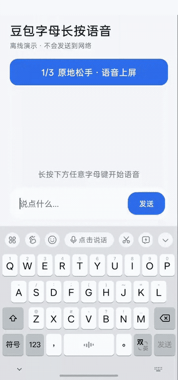

# 豆包字母键长按语音 / Doubao Letter Long-Press Voice

[](https://github.com/gehbfarr5/doubao-letter-longpress-voice/actions/workflows/build.yml)
[](LICENSE)
[](../../releases/latest)

一个 LSPosed 模块：**长按豆包输入法 26 键 / 9 宫格字母键触发语音输入**，按住录音、原地松手上屏、滑到工具栏发送/换行、上滑取消。

> A LSPosed module that lets you long-press any letter key in Doubao IME to start voice input — like the toolbar mic button, but from any letter. Hold to record, release in place to commit, slide to toolbar to send/newline, slide out to cancel.

<p align="center">
  
</p>

> 触摸指示：蓝色圆环表示当前按住位置；圆环从字母键出现，随手指移动，并在松手后消失。
>
> 演示内容：①长按字母键说话，原地松手后文字上屏 ②录音中滑到工具栏，出现蓝色“发送”，松手后触发动作 ③移出键盘，出现红色“撤回输入”，松手后取消且不上屏。
>
> 隐私说明：演示页完全离线，不会发送到网络；录屏顶部通知栏已裁除。
>

---

## ✨ 特性

- **长按任意字母键 (~500ms) 触发语音**，沿用豆包内部 `LONG_PRESS_TIMEOUT` 时长，体感跟原生空格长按一致
- **Press-and-hold 录音 / 原地松手上屏 / 滑到工具栏发送-换行 / 滑出键盘撤回输入**（多手势在录音过程中实时识别）
- **跟随当前输入框 `EnterActionType` 显示语义化标签**：发送 / 搜索 / 前往 / 换行 / 完成 — 与豆包空格长按弹出的"右侧按钮"保持一致
- **滑到工具栏 → 真正执行对应动作**：
  - `GO / SEARCH / SEND / SEND_EXPRESSION` 走 `AsrManager.t(ordinal, now)`（等 ASR 整理结果后再触发，跟豆包空格长按发送同路径）
  - `NEXT / DONE / PREVIOUS / NONE` 走快路径（停止 ASR + `KEYCODE_ENTER`），换行响应在 200ms 内
- **滑出键盘 → 撤回输入**：清掉 preedit + 抑制所有 ASR commit 0.5s
- **跨应用发送（Claude / ChatGPT）**：这类应用的"发送"挂在前端按钮 `onClick` 上、对 IME 动作无回调，IME 层发不出去。模块自带一个 **AccessibilityService**：滑到工具栏松手时先上屏文字，再让无障碍服务找到当前应用的发送按钮并模拟点击（兼容 WebView 与 Jetpack Compose 的语义点击，含排除词过滤 + 优先级排序防止误击附件按钮）。需单独授权无障碍（见安装步骤）
- **前台服务保活**：无障碍服务以前台服务运行，在 ColorOS / OxygenOS 等激进后台管理系统下显著降低被杀概率；重启后通过 root shell 自动恢复授权（需 root）
- **图标徽章 UI**：横向 LinearLayout，复用豆包自家 `oic_send` / `oic_search` / `oic_enter` 图标 + `ic_delete_white`（豆包退格上滑清空那个垃圾桶），间距从豆包候选框 padding 资源动态读取，跟豆包视觉风格一致
- **跟随豆包"按键震动"设置**，复用 `UserInteractiveManagerNext.g(.., SPEECH_START, ..)` 调用链
- **修复了按键残留高亮**，触发时补发 `nativeTouch(ACTION_CANCEL)` 让 native 立刻清掉 pressed 状态
- **commit 走豆包长按面板原生 stop 流程**（v1.3.14 为 `AsrManager.t0()` / `s0(false, ...)`，旧版兼容 `q0()` / `p0(false, "")`），让 ASR 引擎走自然 finalize 流程：尾字不丢、标点自动添加、同音字纠正
- **滑动手势识别**（20dp 阈值，按设备 density 自适应），左右滑动光标移动手势不会误触发语音
- **不破坏原生长按 popup**：数字/符号子层、Shift、Backspace、空格 等的原生长按行为完全保留
- **防御性多层门槛**：数字/电话/日期输入框 → 跳过；`?123` 数字/符号子层 → 跳过；浮动/单手模式 → 跳过；几何不在字母区 → 跳过

## 📦 兼容性

| 项 | 实测环境 | 备注 |
|---|---|---|
| 豆包输入法 | **v1.3.11 / v1.3.14 / v1.3.15** (`com.bytedance.android.doubaoime`) | v1.3.15 使用 Vector/LSPosed Native API 截获动态 `RegisterNatives`，并适配 `AsrManager.J/F/u/w0/t` 与 `AsrLongPressView`；未知签名会明确拒绝接管，不做静默降级 |
| Android | 6.0+ (API 23+) | 取决于 LSPosed 支持范围 |
| LSPosed | 任意版本，xposedminversion=82 | |
| 物理键盘布局 | **26 键 QWERTY**（拼音 / 自然码 / 双拼 / 英文）+ **9 宫格拼音** | 手写键盘走 `HandWritingBoardView`，**自动跳过** |
| 屏幕密度 | mdpi → xxxhdpi 均支持 | 滑动阈值用 dp 表达，运行时按设备 density 自适应 |
| 屏幕分辨率 / 尺寸 | 任意（手机、平板） | v1.3.15 的 zone 判定使用 `getLocationOnScreen()` 与 `MotionEvent.rawX/rawY` 的同一屏幕坐标系，不再用局部比例猜工具栏位置 |
| 横屏 / 平板 | 🚧 不主动适配 | 豆包横屏默认走浮动键盘，浮动模式本来就被排除；如果你的设备/版本是横屏全键盘，几何判定理论上还有效 |
| 浮动键盘 / 单手模式 | 🚫 **不支持**（自动跳过） | 几何比例不固定，强行触发会误判 |
| 跨应用发送（a11y） | **Claude** (`com.anthropic.claude`) + **ChatGPT** (`com.openai.chatgpt`) 实测可发送 | 发送按钮选择器：收集全部候选节点 + 排除词过滤（图片/文件/attachment 等）+ 优先级排序（精确匹配 > 右侧 > 更大面积）；找不到时 dump 候选到 logcat 便于扩展 |
| 跨应用发送（performEditorAction） | **Nekogram** (`tw.nekomimi.nekogram`) 走 IME SEND 动作 | 原生 View 输入框直接 performEditorAction，无需无障碍授权 |

**适配范围说明**：这个模块只针对**普通竖屏全宽键盘**做适配，是绝大多数使用场景。横屏 / 浮动 / 单手等小众场景目前不支持，未来视需求扩展。

## 🚀 安装

1. 设备已 root 并安装 [LSPosed](https://github.com/LSPosed/LSPosed)
2. 安装本模块 APK（见 [Releases](../../releases) 下载，或自行构建）
3. 在 LSPosed 管理器里**启用本模块**并**勾选作用域** `豆包输入法 (com.bytedance.android.doubaoime)`
4. 强制停止豆包输入法（设置 → 应用 → 豆包输入法 → 强制停止）或重启设备
5. 切到豆包 26 键 / 9 宫格，**长按任意字母键 / 拼音键** —— 应该感受到震动并出现语音面板
6. **（可选，仅 Claude / ChatGPT 跨应用发送需要）** 到 **设置 → 无障碍 → 已下载的服务**，启用 **「豆包语音发送助手」**。授权后在 Claude / ChatGPT 里语音输入上滑到工具栏即可自动点击发送；不授权也不影响其它应用的上屏/换行功能

## 🎯 使用

| 动作 | 效果 |
|---|---|
| 长按字母键 500ms | 启动语音 + 震动 + 按键阴影立刻清除 |
| 录音中**原地松手**（手指仍在键盘字母区） | 上屏（带尾音 + 标点 + 引擎级整理） |
| 录音中**手指滑到工具栏**再松手 | 按当前输入框语义触发对应动作（发送/搜索/前往/换行/完成…），文字 + 图标徽章实时显示选中状态 |
| 录音中**手指滑出键盘范围**（上/下）再松手 | 撤回输入：清掉 preedit + 抑制所有 ASR commit 0.5 s，红底垃圾桶徽章实时显示 |
| 长按 Shift / Backspace / 空格 | **不触发本模块**，保留原生长按行为 |
| 切到数字层 (`?123`) 长按数字 | **不触发本模块**，保留原生长按 popup |
| 在真·数字输入框（手机号/验证码/金额） | **不触发本模块**，保留原生数字键盘体验 |
| 长按后水平/垂直滑动（未触发语音前） | **不触发本模块**，保留豆包原生光标移动 / 上划符号 |

## 🛠 自行构建

```bash
git clone <repo-url>
cd doubao-letter-longpress-voice
JAVA_HOME=/path/to/jdk-17-or-21 ./gradlew :app:assembleDebug
adb install -r app/build/outputs/apk/debug/app-debug.apk
```

需要 JDK 17 或更高、Android NDK 29。Gradle 8.9 + AGP 8.7.3 经验证通过；APK 目前只打包 `arm64-v8a` native bridge。

## 🔬 工作原理（实现速读）

### Hook 1：截获 1.3.15 的真实 native 长按哨兵
豆包 1.3.15 通过动态 `RegisterNatives` 把 `KeyboardView.nativeTouch(JIIIJ)V` 绑定到 `libkeyboard.so`，普通 Java/Xposed 方法 hook 无法证明能截获这条调用。模块的 arm64 native bridge 使用 Vector/LSPosed Native API hook `JNIEnv->RegisterNatives`，只替换精确的方法名和签名；当 `action=-1` 的长按哨兵到达时交给 Java 能力门控，处理成功才抑制原 native popup。1.3.14 及旧版仍走其明确适配的 Java Handler 路径。

### Hook 2：单手势会话 + 三路全局 zone 决策
长按触发前保存 `KeyboardView`、`native_candidate_bar`、`InputView` 的屏幕 Rect。录音过程中用 `MotionEvent.rawX/rawY` 在同一坐标系实时判定三个 zone（带 50ms 防抖），每个 `GestureSession` 只允许一个终态：
- **LETTER**（字母区内）→ 当前版本适配器的 graceful stop（v1.3.15: `AsrManager.w0()`；v1.3.14: `t0()`）
- **TOOLBAR**（工具栏区域）→ 按 `EnterActionType`：
  - GO / SEARCH / SEND / SEND_EXPRESSION → `AsrManager.t(ordinal, now)`（等 ASR 整理结果再 perform action，跟豆包空格长按发送同路径）
  - 其余（换行类）→ 停止 ASR 后 `KEYCODE_ENTER`（快路径，避免等 ASR 结果包）
- **OUTSIDE**（键盘上/下方滑出）或 `ACTION_CANCEL` → v1.3.15 调官方 `AsrManager.u()` 撤回；旧版走受控 cancel 抑制窗口

### Hook 3：旧版本 cancel 抑制窗口
豆包 1.3.15 已走官方 `u()`；1.3.14 及更早的 toolbar press-and-hold 模式没有等价 cancel API，因此旧版适配器使用受控抑制窗口：
1. 打开 500 ms `sCancelUntilElapsed` 抑制窗口（cancel 通常在 200-400ms 完成）
2. 立刻调 `KeyboardJni.finishPreedit(false)` 清掉 InputConnection composing 文本
3. 调豆包 stop-ASR API（v1.3.14: `AsrManager.s0(true, "cancel")`；旧版: `p0(true, "cancel")`）停 ASR
4. 窗口内 hook 三个 commit 入口并按需吞掉：
   - `KeyboardJni.commitString(text, _, source)` —— `source` 不在 `keyboard_callback / clipboard / emoji / ...` 白名单则吞
   - `KeyboardJni.onAsrCommitPreeditText()` —— 直接返 `true` 骗调用方"已提交"
   - `KeyboardJni.onAsrSetPreedit(text)` —— 返 `true` 阻止后续 preedit 重设

### Hook 4：IME 生命周期防御
Hook `ImeService.onFinishInput()` 和 `onFinishInputView(boolean)` 清掉所有 per-session 状态，避免 `sSuppressNextUp` / cancel 窗口跨 input session 泄漏。

### Hook 5：徽章 overlay
触发 ASR 后，向豆包 `InputView` (FrameLayout) attach 一个横向 LinearLayout（ImageView + TextView）作为 zone 反馈徽章：
- 工具栏全宽，圆角 8dp，上下左右间距读取豆包 `asr_editor_candidate_container_padding_horizontal`（候选条 padding，视觉对齐）
- 图标资源走豆包自家 `oic_send` / `oic_search` / `oic_enter` / `ic_delete_white`，统一白色 `PorterDuff.SRC_IN` 着色
- 标签文字从豆包 `asr_long_press_send_text` / `search_text` / `go_text` / `enter_text` 等资源动态读取，确保跟豆包空格长按弹出的右侧按钮一致
- zone 切换时 ArgbEvaluator 平滑 180ms 颜色过渡 + OvershootInterpolator scale 1.04 微缩放，松手或离开徽章区域时 120ms 渐隐

### 关键避坑
- `UserInteractiveManagerNext.a` / `AsrManager.a` 的 `<clinit>` 链会触碰 `IAppGlobals`，需要 `sApplication` 已初始化。**绝不能在 `handleLoadPackage` 时访问**，否则 `<clinit>` 失败被永久标记 errored，整个豆包进程起不来。所有 Doubao 单例都走 `ensureXxx()` 懒加载。
- 几何分区按 `kbdType` 分流：QWERTY 系列只排除 bottom 行 + 行 3 边缘；9 宫格排除 bottom 行 + 所有行左右边缘列（容纳左 mode + 右 ⌫）。
- 滑动阈值 20dp 用 device density 转 px，跨密度自适应。

## 📊 已知限制

- 仅适配 **26 键 QWERTY + 9 宫格 Pinyin**。手写键盘自动跳过；浮动/单手模式自动跳过；横屏未主动适配（豆包横屏默认走浮动）。
- 豆包 **v1.3.15** 已在 OnePlus 15 / Android 16 / Vector-SR 上实测核心手势；v1.3.11 / v1.3.14 保留精确签名适配。其它版本若能力矩阵不匹配会拒绝接管并输出诊断日志。
- v1.3.15 native bridge 当前仅打包 `arm64-v8a`；其它 ABI 尚未发布。
- 横向滑出 cancel 失效：豆包 KeyboardView 在常规设备上横向铺满全屏，系统会把 x 钳到边界。**仅支持向上 / 向下滑出 cancel**。
- "整理"效果依赖豆包 ASR 引擎自身能力（标点、同音字纠正等），不是 LLM 级别的语义改写。LLM 候选窗 (`LLMCandidate.updateCandidateList`) 不在本模块范围内。
- 跨应用发送（a11y）目前只支持并实测 **Claude / ChatGPT**。选择器含排除词过滤 + 优先级排序，但应用大改版后节点结构可能变化（服务找不到时会把当前界面候选节点 dump 到 logcat：`adb logcat -s DoubaoVoiceSend`）。需手动授权无障碍服务。
- 跨应用发送（performEditorAction）目前只支持 **Nekogram**。Telegram、文心一言、Gemini、Grok、Kimi 等未真机闭环的应用不在当前支持范围内。

## 🤝 贡献

欢迎 PR 适配新版豆包、扩展键盘布局支持、改善取消手势 UX。本仓库 issue / PR 都欢迎。

## 📜 许可证

[Apache License 2.0](LICENSE)

## ⚠️ 免责声明

本模块仅供个人学习研究使用。豆包输入法是字节跳动旗下产品，本模块与字节跳动无任何关联。使用本模块可能违反豆包输入法用户协议，**请自行评估风险**。

This module is for personal study and research purposes only. Doubao IME is a ByteDance product; this module has no affiliation with ByteDance. Using this module may violate Doubao IME's terms of service. Use at your own risk.
